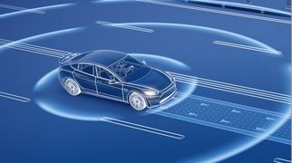
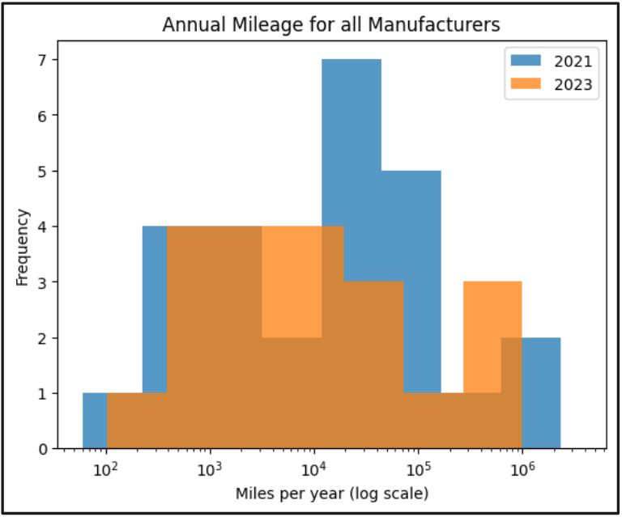

## T-test Study: Autonomous Vehicle Disengagements
### Summary :speaker:
* Background
* Exploratory Data Analysis
* Results and Conclusion
* Reflection and Recommendation

  

### Background 
* Human errors account for 94-96% of vehicle collisions in the United States.
* Autonomous vehicles would be a solution for safer vehicles, and the autonomous vehicle sales are projected to increase over time.
* This study reviews the number of autonomous vehicle disengagements over time in California to show that self-driving technology is improving.
* This study can be used by investors or the general public.

### The Data :bar_chart:
The data was obtained from California Department of Motor Vehicles. Autonomous vehicle companies operating in California must submit a yearly report to the state of California.

 * 2023 Disengagement reports: https://www.dmv.ca.gov/portal/file/2023-autonomous-vehicle-disengagement-reports-csv/
 * 2023 Mileage reports: https://www.dmv.ca.gov/portal/file/2023-autonomous-mileage-reports-csv/
 * 2021 Disengagement reports: https://www.dmv.ca.gov/portal/file/2021-autonomous-vehicle-disengagement-reports-csv/
 * 2021 Mileage reports: https://www.dmv.ca.gov/portal/file/2021-autonomous-mileage-reports-csv/

### Exploratory Data Analysis :paperclip: 
- [x] Data cleaning: Removed all erroneous commas and spaces
- [x] Converted date from string into date format
- [x] Grouped mileage driven by auto manufacturer
- [x] Reviewed annual total miles driven in 2021 and 2023

### Results and Conclusion :bar_chart:
* A T-test study of years 2021 to 2023 indicated a 51% confidence the amount of autonomous disengagements per miles driven have decreased from 2021 to 2023.
* This confidence level is insufficient to show this is true.

  

### Reflection:
* The sample size for autonomous vehicle companies was low for this study.

### Recommendation:
* Compare other metrics that indicate autonomous vehicles are improving over time, such as frequency of collisions of autonomous versus human driven vehicles
* A T-test can be used to compare the frequency of collisions
* Use a different method for comparison instead of average. A few manufacturers had significantly more mileage, so averaging may have skewed the results. 
* Using weighted averages may resolve this.

 

